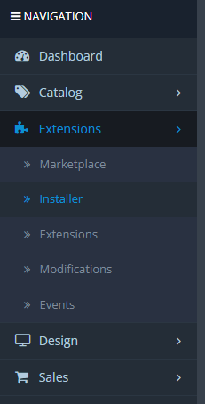
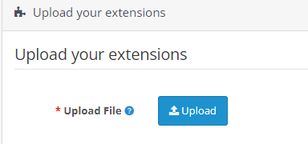
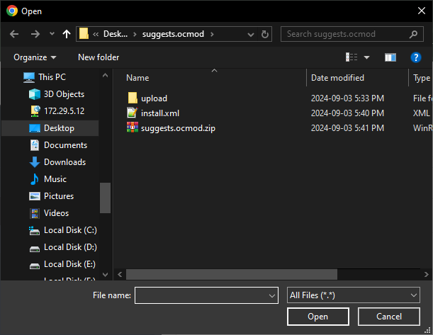
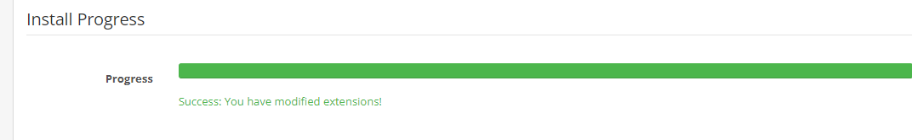
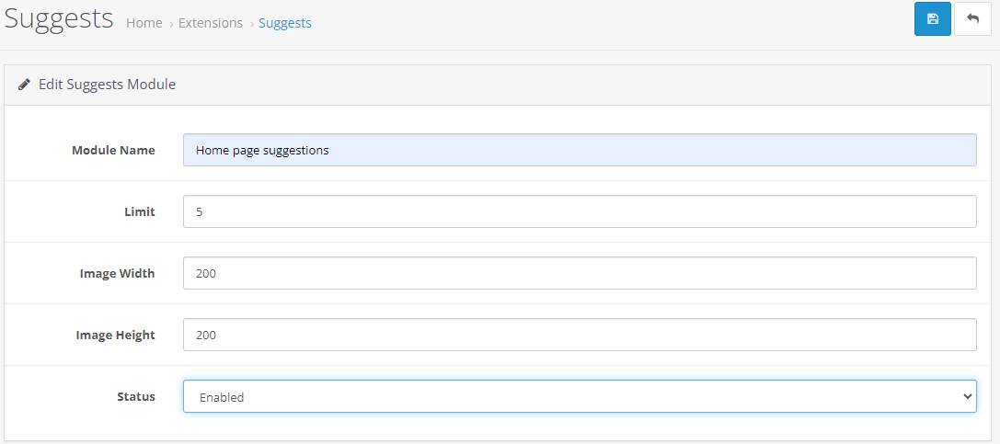
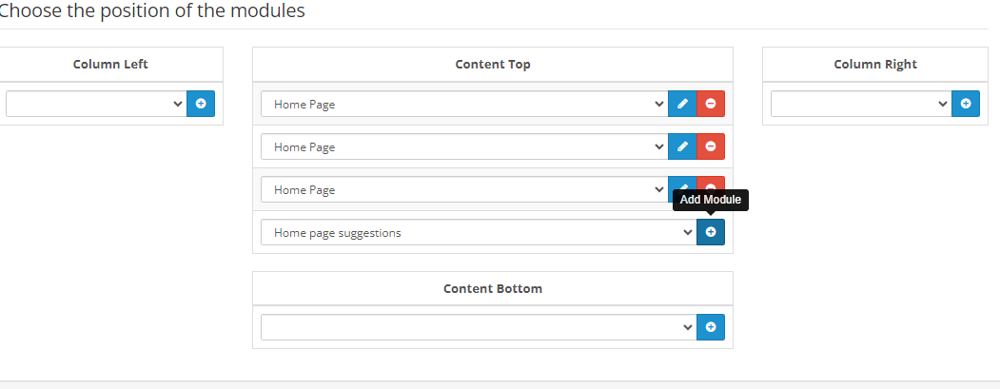

&#x202b;

# مشروع e-commerce recommendation system

## وصف المشروع

يهدف هذا المشروع إلى تطوير Extension لنظام إدارة محتوى التسوق الالكتروني OpenCart، يعتمد على سلوك المستخدم لاستنتاج وعرض اقتراحات المنتجات المناسبة.

يشمل المشروع المكونات الأساسية التالية:

- منصة [OpenCart](https://www.opencart.com/).
- مشروع منفصل مخصص لإنشاء نموذج sli_rec وتدريبه.

## هيكلية المشروع

تم الحصول على الرماز البرمجي لمنصة OpenCart من الموقع الرسي للمنصة.
المجلد الرئيسي للمشروع هو _opencart-3.0.4.0_.

المشروع المنفصل الذي يتم به تدريب النموذج موجود في المجلد الرئيسي ml.

### تفاصيل الملفات والمجلدات في قسم إنشاء النموذج

| الملف/المجلد         | الوصف                                                  |
| -------------------- | ------------------------------------------------------ |
| `creating_model.py`  | الملف الرئيسي لإنشاء النموذج وتدريبه.                  |
| `data.py`            | الملف الذي تم من خلاله إنشاء بيانات التدريب.           |
| `SeqModelWrapper.py` | الملف الذي يحوي تغليف النموذج المختار.                 |
| `util.py`            | ملف مساعد يحوي توابع معالجة البيانات.                  |
| `config/`            | يحتوي على ملفات إعدادات النماذج مثل المعاملات الفائقة. |
| `resources/`         | يحوي على بيانات التدريب.                               |

### الملفات التي تم إنشاؤها في المنصة

هذه الملفات هي ملفات ال extension التي تم إنشاءها.

```
├── admin/
│  ├── controller/extension/module/suggests.php
│  ├── language/en-gb/extension/module/suggests.php
│  └── view/template/extension/module/suggests.twig
├── catalog/
│  ├── controller/extension/module/suggests.php
│  ├── language/en-gb/extension/module/suggests.php
│  ├── model/extension/module/suggests.php
│  └── view/theme/default/template/extension/module/suggests.twig
```

## بيانات التدريب

بيانات التدريب تتكون من ملفين نصيين json

الملف الأول يحوي معلومات عامة عن المنتجات التي يوفرها المتجر الالكتروني ، مثال عنها :

```
{"ItemID": '1005', "Name": "Gaming Console", "Category": "Electronics", "CategoryID": '2001', "Subcategory": "Gaming", "SubcategoryID": '3005'}
{"ItemID": '1006', "Name": "DSLR Camera", "Category": "Electronics", "CategoryID": '2001', "Subcategory": "Cameras", "SubcategoryID": '3006'}
{"ItemID": '1007', "Name": "Bluetooth Speaker", "Category": "Electronics", "CategoryID": '2001', "Subcategory": "Audio", "SubcategoryID": '3004'}
{"ItemID": '1008', "Name": "Tablet", "Category": "Electronics", "CategoryID": '2001', "Subcategory": "Mobile Devices", "SubcategoryID": '3007'}
```

الملف الثاني يحوي بيانات تفاعل المستخدمين مع المنتجات في الموقع، مثال عنها:

```
{"UserID":"user_1","ItemID":1200,"ItemName":"Diecast Car Set","Category":"Toys and Games","CategoryID":2010,"InteractionType":"view","Timestamp":"2020-06-04 10:18:14"}
{"UserID":"user_1","ItemID":1195,"ItemName":"Toy Helicopter","Category":"Toys and Games","CategoryID":2010,"InteractionType":"view","Timestamp":"2020-06-02 07:47:14"}
{"UserID":"user_1","ItemID":1195,"ItemName":"Toy Helicopter","Category":"Toys and Games","CategoryID":2010,"InteractionType":"add to cart","Timestamp":"2020-06-02 08:00:14"}
{"UserID":"user_1","ItemID":1195,"ItemName":"Toy Helicopter","Category":"Toys and Games","CategoryID":2010,"InteractionType":"review 2","Timestamp":"2020-06-02 08:15:14"}
```

## النموذج المدرب

تم الحصول على النموذج المدرب من مكتبة [Microsoft Recommenders ](https://github.com/recommenders-team/recommenders).

وتم استخدام نموذج [SLi_Rec](https://github.com/recommenders-team/recommenders/blob/main/examples/00_quick_start/sequential_recsys_amazondataset.ipynb).

## تثبيت ال Extension على المنصة

لكي يقوم مدير المنصة بتثبيت الإذافة عليه أولا أن يتوجه إلى
Extensions -> Installer



ثم وبالضغط على زر Upload



يختار الملف المضغوط الذي يحوي ملفات الإضافة والذي ينتهي ب ocmod.zip



وتم التاكد من أن عملية التثبيت تمت بشكل صحيح



بعد ذلك يتوجه إلى قائمة الإضافات ويحتار الإضافة التي قام بتثبيتها لكي يقوم بتفعيلها وعرضها في الواجهات التي يرغب بها



وبعد اختيار الإعدادات المرادة يقوم بالضغط على زر الحفظ

ويتوجه إلى صفحة ال Layout ويختار الواجهة المراد عرض الإضافة فيها

ثم يختار مكان عرضها في هذه الواجهة

وبعد الانتهاء يقوم بالضغط على زر الحفظ



## تشغيل المشروع

نحتاج أولا أن نقوم بتدريب النموذج او تحميله في حال تم تدريبه مسبقا، نقوم بذلك عن طريق تنفيذ الملف _creating_model.py_.

فيتم به معالجة بيانات التدريب وإنشاء نموذج وتسجيله في _MLflow_، كما يتم حفظ النموذج المجرب لنتمكن من تحميله لاحقا دون إعادة تدريبه.

في الخطوة التالية نقوم بتشغيل النموذج وتخديمه باستخدام _MLflow_، عن طريق تنفيذ التعلمية التالية في منفذ الأوامر:

```
mlflow models serve -m SeqModel_with_wrapper --port 5000 --no-conda
```

وبذلك نستطيع الحصول على اقتراحات في المنصة باستخدام _REST API_.
